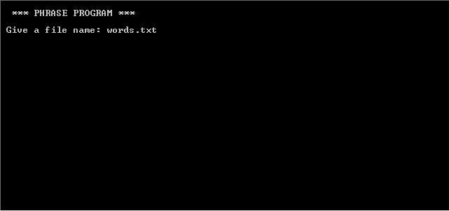

# Words

### Demo

First user add name of a file.

Program prints total number of words and also number of different words. 
After that program prints words in descending order.

User can choose if want to print every occurencies of biggest word.

If user choose Y program print all occurencies.

